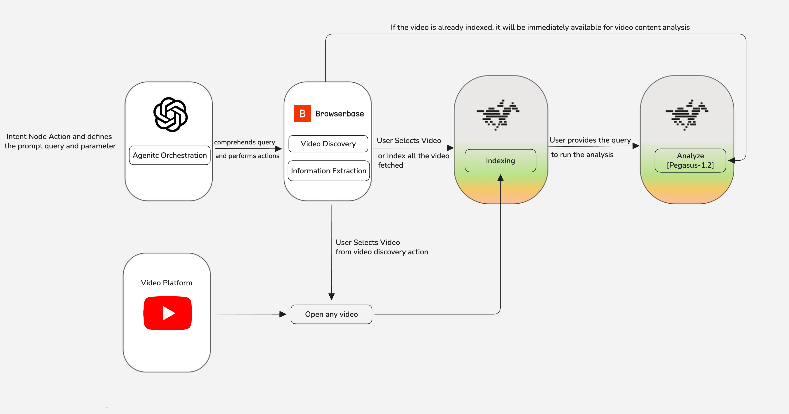
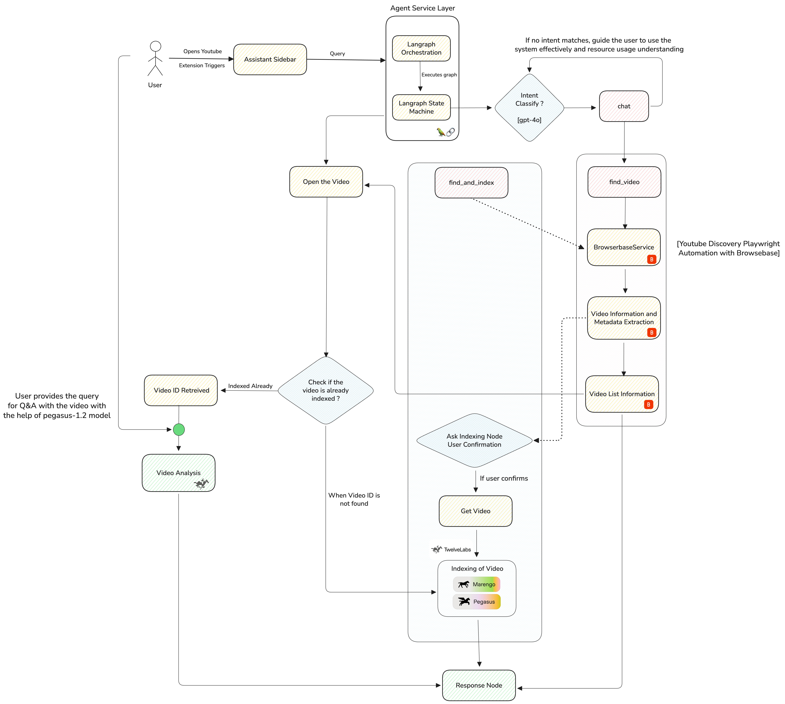

<div align="center">

# TwelveLabs Video Assistant Extension

**TwelveLabs powered browser extension for YouTube that provides video understanding, analysis, and chat capabilities**

---

</div>

## 🚀 Features

- Automatic video indexing through Twelve Labs with real time video content analysis

- Browserbase integration for browser automation capabilities for video discovery and information extraction

- Multiple analysis types including semantic search, chapter segmentation, highlight extraction, summarization and open-ended analysis on video content

- Configurable analysis_type parameters for flexible video content processing

- Chrome storage local API for persistent video ID mapping and session state management

- Agentic chat interface with intent node classification for dynamic video discovery, indexing, and analysis workflows

- Real-time streaming response handling with status updates and progress indicators

## 📋 Table of Contents

- [Installation](#installation)
- [Configuration](#configuration)
- [Usage](#usage)
- [Architecture](#architecture)
- [Project Structure](#project-structure)
- [Development](#development)
- [API Endpoints](#api-endpoints)
- [Contributing](#contributing)
- [License](#license)

## 🔧 Installation

### Prerequisites

- Node.js (v14 or higher)
- npm or yarn
- Chrome/Edge browser
- Backend API server 

### Steps

1. **Clone the repository**
   ```bash
   git clone https://github.com/Hrishikesh332/Yt_TL_extension.git
   cd youtube-extension
   ```

2. **Install dependencies**
   ```bash
   npm install
   ```

3. **Configure environment variables**
   ```bash
   # Create .env file in the root directory
   echo "BACKEND_URL=https://your-backend-url.com" > .env
   ```

4. **Build the extension**
   ```bash
   npm run build
   ```

5. **Load the extension in Chrome/Edge**
   - Open Chrome/Edge and navigate to `chrome://extensions/` or `edge://extensions/`
   - Enable "Developer mode" (toggle in top right)
   - Click "Load unpacked"
   - Select the project directory

## ⚙️ Configuration

### Environment Variables

Create a `.env` file in the root directory -

```env
BACKEND_URL=https://your-backend-url.com
```

The build script will automatically inject this URL into the extension during the build process.

### Backend API Requirements

The extension requires a backend API server that implements the following endpoints -

- `GET /api/health` - Health check endpoint
- `POST /api/download-and-index` - Download and index YouTube videos
- `POST /api/analyze` - Analyze indexed videos (summary, chapters, highlights, search)
- `POST /api/agentic-chat` - General chat interface
- `POST /api/agentic-chat/stream` - Streaming chat interface

###### *This Endpoints are the one configured for the Extension, there are other supporting Endpoints defined in the backend details*

## 📖 Usage

### On Video Pages

1. Navigate to any YouTube video
2. The extension sidebar will automatically open
3. The video will be auto indexed (if not already indexed)
4. Ask questions like -
   - "Summarize this video"
   - "Chapterize this video"
   - "What are the highlights?"
   - "What does the video say about [topic]?"
   OR any question, one would like too

### On Main/Home Page

1. Open the extension sidebar
2. Ask general questions -
   - "Find 2 videos about cooking recipes"
   - "Get videos about machine learning"
   - "Search for Python tutorials"

## 🏗️ Architecture

### Component Flow



### System Architecture



Data flows unidirectionally from user interactions through content scripts to service workers, which then communicate with backend APIs. 

## 📁 Project Structure

```
youtube-extension/
├── background.js          
├── content.js            
├── popup.js              
├── popup.html             
├── styles.css              
├── build.js               
├── manifest.json        
├── package.json          
├── .env                    
├── icons/                  
│   ├── icon16.png
│   ├── icon48.png
│   ├── icon128.png
│   ├── logo_control.png
│   └── twelvelabs-logo.png
└── src/                    
    ├── browserbase_arch.png
    └── browserbasev2.png
```

## 🛠️ Development

### Build Commands

```bash
# Build extension with environment variables
npm run build

# Development build
npm run dev

# Test backend connection
npm test
```

### Development Workflow

1. Make changes to the code
2. Update `.env` if backend URL changes
3. Run `npm run build` to inject environment variables
4. Reload the extension in Chrome/Edge (`chrome://extensions/` → Reload)

*This extension requires a backend API server to function. Make sure your backend is properly configured and accessible before using the extension.*

## 🔌 API Endpoints

### Health Check
```http
GET /api/health
```

### Video Indexing
```http
POST /api/download-and-index
Content-Type: application/json

{
  "youtube_url": "https://www.youtube.com/watch?v=..."
}
```

### Video Analysis
```http
POST /api/analyze
Content-Type: application/json

{
  "video_id": "twelvelabs_video_id",
  "analysis_type": "summary" | "chapter" | "highlight" | "open-ended",
  "prompt": "optional custom prompt"
}
```

### Agentic Chat
```http
POST /api/agentic-chat/stream
Content-Type: application/json

{
  "query": "Find 2 videos about cooking",
  "conversation_context": {
    "auto_index": true
  }
}
```

## 🤝 Contributing

Contributions are welcome! Please follow these steps -

1. Fork the repository
2. Create a feature branch (`git checkout -b feature/amazing-feature`)
3. Commit your changes (`git commit -m 'Add some amazing feature'`)
4. Push to the branch (`git push origin feature/amazing-feature`)
5. Open a Pull Request


## 📝 License

This project is licensed under the MIT License - see the LICENSE file for details.

## 🔗 Related Links

- [Twelve Labs API Documentation](https://docs.twelvelabs.io/docs/get-started/introduction)
- [BrowserBase Documentation](https://docs.browserbase.com/reference/api/overview)

## 📧 Contact

For questions, issues, or contributions, please open an issue on GitHub.

---


